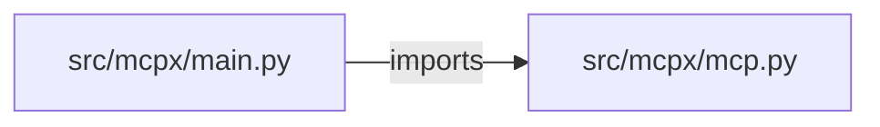

# multi-mcp-cloudops-agent — project architecture

[README](README.md) · [Interview questions and answers](INTERVIEW_QA.md)

## Purpose and scope

Agent → MCP → K8s / GCP / GitHub / Prometheus. Destructive ops need approved=true.

This document describes files and symbols in this checkout. Deployment templates and statements in the original overview are distinguished from a verified running environment.

## Component diagram



For Python repositories, arrows show resolved local imports, not network calls or deployment order. Otherwise the diagram is a repository component map; containment arrows do not assert runtime integration.

## Components and responsibilities

| Component | Responsibility |
| --- | --- |
| [`src/mcpx/main.py`](src/mcpx/main.py) | HTTP handlers: `GET /healthz`, `GET /tools`, `POST /call` |
| [`src/mcpx/mcp.py`](src/mcpx/mcp.py) | Functions: `list_tools`, `call` |
| [`requirements.txt`](requirements.txt) | Implementation or supporting configuration |
| [`tests/test_mcp.py`](tests/test_mcp.py) | Executable checks and regression examples |
| [`.github/workflows/ci.yml`](.github/workflows/ci.yml) | GitHub Actions job definitions |
| [`README.md`](README.md) | Project explanations or operating notes |

## Request interface

| Method and path | Handler | Source |
| --- | --- | --- |
| `GET /healthz` | `healthz` | [`src/mcpx/main.py`](src/mcpx/main.py#L6) |
| `GET /tools` | `tools` | [`src/mcpx/main.py`](src/mcpx/main.py#L10) |
| `POST /call` | `post_call` | [`src/mcpx/main.py`](src/mcpx/main.py#L14) |

The table lists literal route decorators found in the inspected Python modules. Router prefixes and middleware can add behavior; check the linked handler and application setup before calling an endpoint.

## Implementation walkthrough

### `call(name, arguments, approved=False)`

Source: [`src/mcpx/mcp.py`](src/mcpx/mcp.py#L4).

Calls visible in this function: `ValueError`, `any`, `str`, `str(arguments).lower`.

```python
def call(name, arguments, approved=False):
    if name not in TOOLS:
        raise ValueError("unknown tool")
    blob = str(arguments).lower() + name
    destructive = any(w in blob for w in ("apply", "delete", "destroy", "kubectl apply"))
    if destructive and not approved:
        return {"ok": False, "needs_approval": True, "applied": False}
    return {"ok": True, "tool": name, "echo": arguments or {}, "applied": False}
```

### `list_tools()`

Source: [`src/mcpx/mcp.py`](src/mcpx/mcp.py#L2).

```python
def list_tools():
    return {"tools": TOOLS}
```

## Validation and failure paths

| Explicit exception | Source |
| --- | --- |
| `HTTPException(422, str(exc))` | [`src/mcpx/main.py`](src/mcpx/main.py#L18) |
| `ValueError('unknown tool')` | [`src/mcpx/mcp.py`](src/mcpx/mcp.py#L6) |

These are explicit exceptions in the inspected source, rather than a claim that every failure is handled. Follow the calling handler to see whether the exception becomes an HTTP response or propagates.

## Data and state

- [`src/mcpx/mcp.py`](src/mcpx/mcp.py) defines module-level containers: `TOOLS`.

Module-level dictionaries/lists live in a Python process. They can be fixtures or mutable state; inspect writes before treating them as persistent storage. A production extension would need to define persistence and concurrency behavior explicitly.

## Data flow and design decisions

### What is the input-to-output contract of `call`

In [`src/mcpx/mcp.py`](src/mcpx/mcp.py#L4), `call(name, arguments, approved=False)` receives the inputs. The function computes these intermediate values:

- `blob = str(arguments).lower() + name`
- `destructive = any((w in blob for w in ('apply', 'delete', 'destroy', 'kubectl apply')))`

Its result is defined by:

- `{'ok': True, 'tool': name, 'echo': arguments or {}, 'applied': False}`
- `{'ok': False, 'needs_approval': True, 'applied': False}`

### Which decision rules or boundary conditions should an interviewer challenge

The implementation in [`src/mcpx/mcp.py`](src/mcpx/mcp.py#L4) branches on:

- `name not in TOOLS`
- `destructive and (not approved)`

A useful extension is a table-driven test that covers each condition just below, at, and above its boundary where applicable. These expressions are the current rules; changing them changes behavior and should be justified by the project’s acceptance criteria.

## Setup and verification

The following commands are derived from the checked-in dependency/test contracts. Execute them from the repository root; the block prepares a local environment, not a cloud deployment.

```bash
python3 -m venv .venv
source .venv/bin/activate
python -m pip install -r requirements.txt
python -m pytest -q
```

Python dependencies: [`requirements.txt`](requirements.txt).

Test entry points: [`tests/test_mcp.py`](tests/test_mcp.py).

Automation definitions: [`.github/workflows/ci.yml`](.github/workflows/ci.yml). Read their triggers and job steps to determine what CI actually runs.

## Operating boundaries and design review

Before turning this checkout into a customer deployment, establish the input contract, data ownership, access controls, failure response, evaluation criteria, and rollback owner. Repository fixtures and unit tests demonstrate local behavior; they do not establish throughput, uptime, compliance, or business impact.

A useful architecture review starts with the linked implementation: identify where input enters, where a decision is made, which state can change, and which external dependency can fail. Add a deployment view only for infrastructure that is actually configured and exercised.
